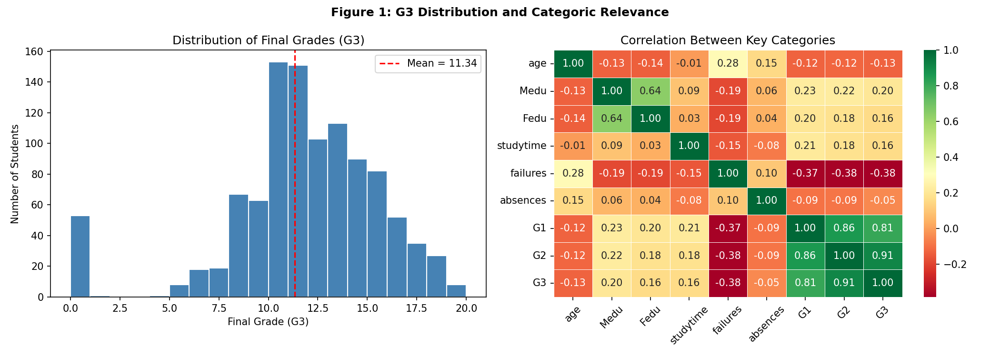
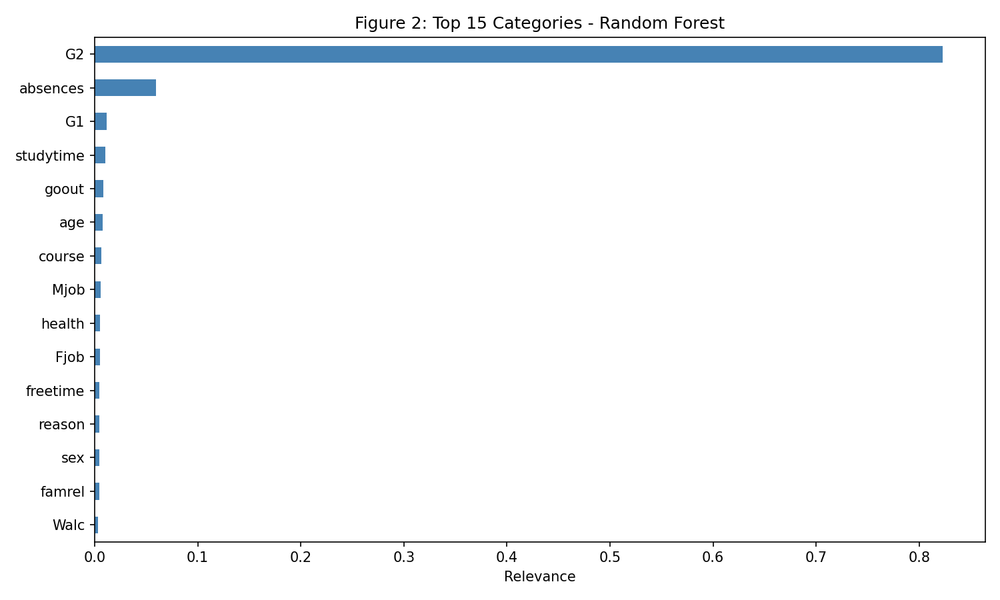
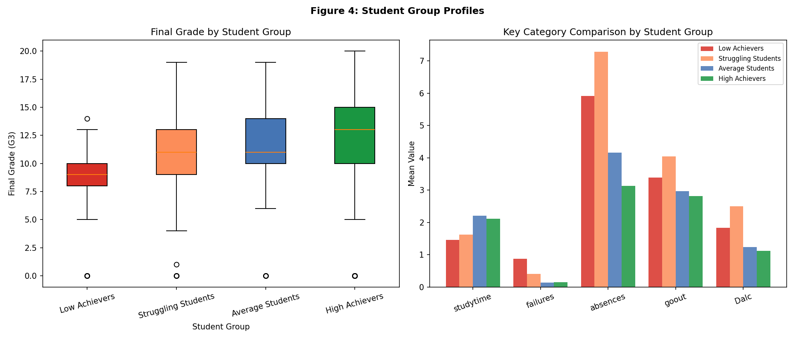

# Student Performance Prediction & Segmentation

Predicting secondary school student outcomes and segmenting learners into actionable intervention groups using supervised and unsupervised machine learning.

## Overview

This project analyses 1,044 student records across 34 features to answer two questions:

1. **What drives academic performance?** — A Random Forest regression model identifies the strongest predictors of final grades.
2. **Can we segment students into meaningful groups?** — K-Means clustering uncovers four distinct learner profiles, each mapped to targeted support strategies.

## Key Results

| Metric | Value |
|--------|-------|
| Random Forest R² | 0.82 |
| Random Forest RMSE | 1.65 |
| Baseline (Linear Regression) R² | 0.80 |
| Cross-validated R² (5-fold) | 0.78 ± 0.05 |
| Optimal clusters | 4 |

### Learner Profiles Identified

- **Low Achievers** (n=89, mean grade 8.35) — require intensive academic support
- **Struggling Students** (n=222, mean grade 10.73) — highest absences and alcohol consumption; need pastoral intervention
- **Average Students** (n=182, mean grade 11.19) — benefit from targeted tutoring
- **High Achievers** (n=551, mean grade 12.12) — suited for enrichment and higher education guidance

### Notable Finding

Students aspiring to higher education scored **3+ grade points higher** on average than those who didn't — highlighting motivational aspiration as a high-impact intervention target.

## Project Structure

```
├── data/
│   └── student_performance.csv
├── notebooks/
│   └── analysis.ipynb
├── outputs/
│   ├── fig1_G3_Distribution.png
│   ├── fig2_Relevant_Categories.png
│   ├── fig3_Optimal_Groups.png
│   ├── fig4_Student_Group_Profiles.png
│   ├── fig5_Qualitative_Analysis.png
│   └── fig6_Frequency_Analysis.png
├── README.md
└── requirements.txt
```

## Methodology

**Preprocessing** — Binary and label encoding of categorical variables. StandardScaler applied for clustering. No missing values in the dataset.

**Supervised Learning** — Random Forest Regressor (200 estimators) with 80/20 train-test split and 5-fold cross-validation. Benchmarked against a Linear Regression baseline.

**Unsupervised Learning** — K-Means clustering on 14 modifiable features. Optimal *k* selected using the Elbow Method and Silhouette Coefficient. Final grade (G3) excluded from clustering to avoid target leakage, then used as external validation.

**Categorical Analysis** — Frequency and mean-grade cross-tabulation of qualitative variables (school choice reason, guardian type, maternal occupation) to surface contextual patterns.

## Sample Outputs

### Grade Distribution & Feature Correlations


### Top 15 Predictive Features


### Learner Cluster Profiles


## Tools

- Python 3
- pandas, NumPy
- scikit-learn (RandomForestRegressor, KMeans, StandardScaler)
- matplotlib, seaborn

## Data Source

[UCI Machine Learning Repository — Student Performance Dataset](https://archive.ics.uci.edu/ml/datasets/student+performance) (Cortez & Silva, 2008)

## Limitations & Future Work

- Dataset is from Portuguese secondary schools (2005–2006); transferability to other contexts is limited
- Silhouette score of 0.125 suggests overlapping clusters — Gaussian Mixture Models could offer more flexible, probabilistic segmentation
- The "text mining" component operates on structured categorical fields; integrating genuine free-text data (e.g. student surveys) would enable LDA topic modelling and sentiment analysis

## License

This project is for portfolio and educational purposes. The dataset is publicly available from the UCI ML Repository.
